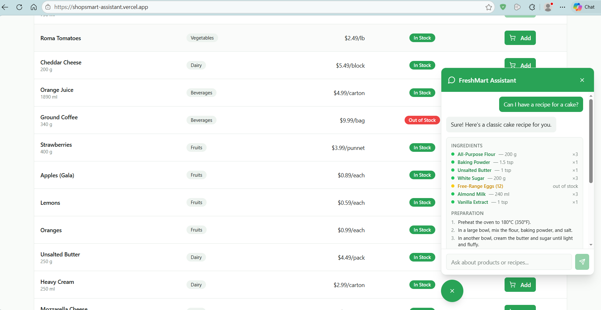

# FreshMart — AI Shopping Assistant

**Live site:** https://shopsmart-assistant.vercel.app/



## How the Chatbot Works

### The Recipe Flow

When a user asks for a recipe (e.g. *"give me a pasta recipe"*), the following happens:

```
1. User types: "give me a pasta recipe"
        │
        ▼
2. LLM (Qwen 2.5 via Together.ai)
   — knows pasta recipes from training data
   — lists the ingredients it needs: eggs, flour, olive oil, parmesan...
   — writes preparation steps with quantities and timing
        │
        ▼
3. Backend queries Turso for each ingredient
   — searches the products table by name and category
   — checks quantity > 0 (in stock) vs quantity == 0 (out of stock) vs not found
        │
        ▼
4. Results sent to frontend as a proposal card
   — green  = available in store
   — yellow = out of stock
   — red    = not carried
        │
        ▼
5. User clicks "Add X items to cart"
   — backend decrements stock in Turso for each item
   — frontend updates the cart
```

### How Pydantic AI Structures the LLM Output

Rather than asking the LLM to return free text and then trying to parse it, the app uses **Pydantic AI** to force the LLM to respond with a typed Python object. The LLM essentially *writes structured data* that matches a predefined schema.

The schema is defined as Pydantic models:

```python
# backend/agent.py

class RecipeIngredient(BaseModel):
    name: str           # e.g. "fresh mozzarella cheese"
    search_term: str    # simplified store term, e.g. "mozzarella"
    cooking_amount: str # e.g. "200 g"
    quantity: int       # units to add for single-item requests

class CartAction(BaseModel):
    action: Literal["propose", "none"]
    recipe_ingredients: list[RecipeIngredient]
    steps: list[str]    # preparation steps
    is_recipe: bool

class AgentResponse(BaseModel):
    message: str        # one-line intro shown in chat
    cart_action: CartAction
```

Pydantic AI passes this schema to the LLM and validates the response against it. The LLM never returns plain text for the action — it always returns a structured object. This means the backend can reliably read `cart_action.recipe_ingredients` and query Turso without any string parsing.

The `search_term` field is particularly important: the LLM simplifies ingredient names (e.g. "fresh free-range eggs" → `"eggs"`) so the database LIKE query has a much better chance of finding a match.

---

## Setup

- Make sure to have a /backend/.env.local similar to /backend/.env.example with personal keys

## Running the Backend

- Navigate to the backend folder
- run `uv run uvicorn main:app --reload --port 8000`

## Running the Frontend

- `bun run dev`

## Debugging the DB

- `turso db shell shopsmart` and query running e.g. `SELECT * FROM products;`


